# Composio OAuth Flow Sequence Diagram

This document describes the OAuth authentication flow for Composio integrations in Orbimesh, based on the `composio_auth.py` implementation.

## Overview

The OAuth flow enables users to securely connect their external app accounts (Gmail, Zoho Books, GitHub, etc.) to Orbimesh through Composio's authentication service. The flow uses Composio's Connect Link for user authentication and stores encrypted connection IDs in the database.

## Sequence Diagram

```mermaid
sequenceDiagram
    participant User
    participant Frontend
    participant Backend
    participant ComposioAuthManager
    participant ComposioAPI as Composio API
    participant Database
    
    Note over User,Database: Phase 1: Initiate OAuth Flow
    
    User->>Frontend: Click "Connect App" (e.g., Gmail)
    Frontend->>Backend: POST /api/integrations/connect
    Note right of Frontend: {user_id, app_slug}
    
    Backend->>ComposioAuthManager: start_auth_flow(user_id, app_slug)
    
    ComposioAuthManager->>ComposioAuthManager: _get_auth_config_id(app_slug)
    Note right of ComposioAuthManager: Retrieves auth config from env<br/>e.g., COMPOSIO_AUTH_CONFIG_GMAIL
    
    ComposioAuthManager->>ComposioAuthManager: _get_integration_id(app_slug)
    Note right of ComposioAuthManager: Resolves Composio integration UUID
    
    ComposioAuthManager->>ComposioAPI: connected_accounts.initiate()
    Note right of ComposioAuthManager: Parameters:<br/>- integration_id<br/>- entity_id (user_id)<br/>- redirect_url (optional)
    
    ComposioAPI-->>ComposioAuthManager: Connection Request
    Note left of ComposioAPI: Returns:<br/>- redirect_url (Connect Link)<br/>- connectedAccountId
    
    ComposioAuthManager->>ComposioAuthManager: _encrypt_connection_id(connection_id)
    Note right of ComposioAuthManager: Encrypts using Fernet cipher
    
    ComposioAuthManager->>Database: Save UserConnection
    Note right of Database: Status: INITIATED<br/>Connection ID: encrypted
    
    ComposioAuthManager->>Database: Log ConnectionLog event
    Note right of Database: Event: auth_initiated
    
    ComposioAuthManager-->>Backend: {success, redirect_url, connection_id}
    Backend-->>Frontend: {redirect_url, poll_status_url}
    
    Note over User,Database: Phase 2: User Authentication
    
    Frontend->>User: Redirect to redirect_url
    Note right of Frontend: Opens Composio Connect Link<br/>e.g., https://connect.composio.dev/link/ln_abc123
    
    User->>ComposioAPI: Authenticate with App (OAuth)
    Note right of User: User logs into Gmail/Zoho/etc.<br/>Grants permissions
    
    ComposioAPI->>ComposioAPI: Complete OAuth flow
    ComposioAPI->>User: Redirect to callback_url
    Note left of ComposioAPI: Connection now ACTIVE in Composio
    
    User->>Frontend: Return to application
    
    Note over User,Database: Phase 3: Verify Connection Status
    
    Frontend->>Backend: GET /api/integrations/status/{user_id}/{app_slug}
    Note right of Frontend: Polling every 2-3 seconds
    
    Backend->>ComposioAuthManager: check_connection_status(user_id, app_slug)
    
    ComposioAuthManager->>ComposioAPI: connected_accounts.get(entity_ids=[user_id])
    Note right of ComposioAuthManager: Retrieves all connections for user
    
    ComposioAPI-->>ComposioAuthManager: List of connections
    Note left of ComposioAPI: Each connection includes:<br/>- app_name<br/>- status (active/inactive)<br/>- connected_account_id
    
    loop For each connection
        ComposioAuthManager->>ComposioAuthManager: Check if status == "active"
        
        alt Connection is active
            ComposioAuthManager->>ComposioAuthManager: _encrypt_connection_id()
            ComposioAuthManager->>Database: Update/Create UserConnection
            Note right of Database: Status: active<br/>Connection ID: encrypted<br/>Timestamp: now
            
            ComposioAuthManager->>Database: Log ConnectionLog event
            Note right of Database: Event: auth_completed<br/>Status: success
        end
    end
    
    ComposioAuthManager-->>Backend: {success, connected_apps, pending_apps}
    Backend-->>Frontend: Connection status
    
    alt Connection is active
        Frontend->>User: Show "Connected" status
        Note right of Frontend: Display checkmark, enable features
    else Connection still pending
        Frontend->>Frontend: Continue polling
    end
    
    Note over User,Database: Phase 4: Using Connection (Agent Execution)
    
    User->>Frontend: Execute workflow (e.g., "Send email")
    Frontend->>Backend: POST /api/orchestrator/execute
    Backend->>ComposioAuthManager: get_connection_for_agent(user_id, app_slug)
    
    ComposioAuthManager->>Database: Query UserConnection
    Note right of Database: Filter by user_id, app_slug<br/>Status: active or stale
    
    Database-->>ComposioAuthManager: UserConnection record
    
    alt Connection needs verification (>1 hour old)
        ComposioAuthManager->>ComposioAuthManager: _decrypt_connection_id()
        ComposioAuthManager->>ComposioAPI: connected_accounts.get(connected_account_id)
        
        alt Verification successful
            ComposioAPI-->>ComposioAuthManager: Connection details
            ComposioAuthManager->>Database: Update last_verified timestamp
        else Verification failed
            ComposioAuthManager->>Database: Update status to "stale"
            ComposioAuthManager-->>Backend: None (connection invalid)
            Backend-->>Frontend: Error: Reconnect required
        end
    end
    
    ComposioAuthManager->>ComposioAuthManager: _decrypt_connection_id()
    ComposioAuthManager-->>Backend: {connection_id, app_slug, status}
    Note left of ComposioAuthManager: Connection ID is decrypted<br/>for agent use
    
    Backend->>Backend: Execute agent with connection_id
    Note right of Backend: Agent uses connection_id<br/>to call Composio tools
    
    Note over User,Database: Phase 5: Token Refresh (Optional)
    
    Backend->>ComposioAuthManager: refresh_connection(user_id, app_slug)
    Note right of Backend: Called when:<br/>- Connection becomes stale<br/>- API returns 401<br/>- Proactive refresh
    
    ComposioAuthManager->>Database: Get UserConnection
    Database-->>ComposioAuthManager: Connection details
    
    ComposioAuthManager->>ComposioAuthManager: _decrypt_connection_id()
    ComposioAuthManager->>ComposioAPI: connected_accounts.refresh(connected_account_id)
    
    ComposioAPI-->>ComposioAuthManager: Refreshed connection
    
    ComposioAuthManager->>Database: Update auth_timestamp
    ComposioAuthManager->>Database: Log ConnectionLog event
    Note right of Database: Event: refreshed<br/>Status: success
    
    ComposioAuthManager-->>Backend: {success, refreshed_at}
    
    Note over User,Database: Phase 6: Disconnect (Optional)
    
    User->>Frontend: Click "Disconnect App"
    Frontend->>Backend: POST /api/integrations/disconnect
    
    Backend->>ComposioAuthManager: disconnect_app(user_id, app_slug)
    
    ComposioAuthManager->>ComposioAPI: connected_accounts.list(user_ids=[user_id])
    ComposioAPI-->>ComposioAuthManager: List of connections
    
    ComposioAuthManager->>ComposioAPI: connected_accounts.delete(connection_id)
    ComposioAPI-->>ComposioAuthManager: Deletion confirmed
    
    ComposioAuthManager->>Database: Delete UserConnection record
    ComposioAuthManager->>Database: Log ConnectionLog event
    Note right of Database: Event: disconnected<br/>Status: success
    
    ComposioAuthManager-->>Backend: {success, message}
    Backend-->>Frontend: Disconnection confirmed
    Frontend->>User: Show "Disconnected" status
```



## Key Components

### 1. ComposioAuthManager
The central authentication manager that handles all OAuth operations:
- **Location**: `backend/services/integrations/composio_auth.py`
- **Singleton**: Accessed via `get_auth_manager()`
- **Responsibilities**:
  - Initiating OAuth flows
  - Managing connection lifecycle
  - Encrypting/decrypting connection IDs
  - Database operations
  - Error handling and logging

### 2. Composio API
External service providing OAuth and integration capabilities:
- **SDK**: Official Composio Python SDK
- **Key Methods**:
  - `connected_accounts.initiate()` - Start OAuth flow
  - `connected_accounts.get()` - Check connection status
  - `connected_accounts.refresh()` - Refresh OAuth tokens
  - `connected_accounts.delete()` - Remove connection

### 3. Database Tables

#### UserConnection
Stores active connections with encrypted connection IDs:
```python
{
    "id": "uuid",
    "user_id": "user_123",
    "app_slug": "gmail",
    "connection_id": "encrypted_ca_xZUTNToOnUiQ",  # Encrypted with Fernet
    "status": "active",  # INITIATED, active, stale, disabled
    "auth_timestamp": "2025-02-15T10:30:00Z",
    "last_verified": "2025-02-15T11:00:00Z",
    "app_metadata": {}
}
```

#### ConnectionLog
Audit trail for all connection events:
```python
{
    "user_id": "user_123",
    "app_slug": "gmail",
    "connection_id": "ca_xZUTNToOnUiQ",
    "event_type": "auth_completed",  # initiated, completed, refreshed, disconnected
    "status": "success",  # success, failed
    "error_message": null,
    "timestamp": "2025-02-15T10:30:00Z"
}
```

## Security Features

### 1. Connection ID Encryption
All connection IDs are encrypted before storage using Fernet symmetric encryption:
- **Key Source**: `CONNECTION_ENCRYPTION_KEY` environment variable
- **Algorithm**: Fernet (AES-128-CBC with HMAC)
- **Encryption**: `_encrypt_connection_id()` before database write
- **Decryption**: `_decrypt_connection_id()` when retrieving for use

### 2. Connection Verification
Connections are automatically verified if last check was >1 hour ago:
- Prevents using stale/revoked connections
- Updates `last_verified` timestamp on success
- Marks connection as "stale" on failure

### 3. Audit Logging
All connection events are logged to `ConnectionLog` table:
- Provides complete audit trail
- Tracks success/failure of operations
- Includes error messages for debugging

## Error Handling

The system handles various error scenarios:

1. **Auth Config Not Found**: Clear error message with setup instructions
2. **Connection Timeout**: Retry logic with exponential backoff
3. **Invalid Connection**: Graceful degradation, prompts reconnection
4. **Rate Limiting**: User-friendly error messages
5. **Token Expiry**: Automatic refresh mechanism

## Environment Variables

Required configuration:
```bash
# Composio API credentials
COMPOSIO_API_KEY=your_api_key

# Encryption key for connection IDs (generate with Fernet.generate_key())
CONNECTION_ENCRYPTION_KEY=your_fernet_key

# Auth configs for each app (created in Composio dashboard)
COMPOSIO_AUTH_CONFIG_GMAIL=ac_gmail_123
COMPOSIO_AUTH_CONFIG_ZOHOBOOKS=ac_zohobooks_456
COMPOSIO_AUTH_CONFIG_GITHUB=ac_github_789
```

## Frontend Integration

The frontend should implement:

1. **Initiate Connection**:
   ```javascript
   const response = await fetch('/api/integrations/connect', {
     method: 'POST',
     body: JSON.stringify({ user_id, app_slug: 'gmail' })
   });
   const { redirect_url } = await response.json();
   window.location.href = redirect_url;  // Redirect to Composio
   ```

2. **Poll Connection Status**:
   ```javascript
   const pollInterval = setInterval(async () => {
     const status = await fetch(`/api/integrations/status/${user_id}/gmail`);
     const { connected_apps } = await status.json();
     
     if (connected_apps.includes('gmail')) {
       clearInterval(pollInterval);
       showSuccessMessage();
     }
   }, 2000);  // Poll every 2 seconds
   ```

3. **Handle Callback**:
   ```javascript
   // After Composio redirects back
   useEffect(() => {
     if (window.location.search.includes('connection=success')) {
       // Trigger status check
       checkConnectionStatus();
     }
   }, []);
   ```

## Best Practices

1. **Always encrypt connection IDs** before storing in database
2. **Verify connections** before use if >1 hour old
3. **Log all events** to ConnectionLog for audit trail
4. **Handle errors gracefully** with user-friendly messages
5. **Use polling** (not webhooks) for connection status checks
6. **Refresh tokens proactively** before expiration
7. **Clean up** disconnected connections from database

## Troubleshooting

Common issues and solutions:

| Issue | Cause | Solution |
|-------|-------|----------|
| "Auth config not found" | Missing environment variable | Add `COMPOSIO_AUTH_CONFIG_{APP}` to .env |
| "Connection not found" | User hasn't connected | Call `start_auth_flow()` first |
| "Invalid encryption key" | Wrong CONNECTION_ENCRYPTION_KEY | Generate new key with Fernet.generate_key() |
| "Connection stale" | Token expired or revoked | Call `refresh_connection()` or reconnect |
| Polling never completes | User didn't complete OAuth | Check Composio dashboard for connection status |

## Related Documentation

- [Composio Official Docs](https://docs.composio.dev/docs/authenticating-users/manually-authenticating)
- [Composio Python SDK](https://github.com/ComposioHQ/composio)
- [Fernet Encryption](https://cryptography.io/en/latest/fernet/)
